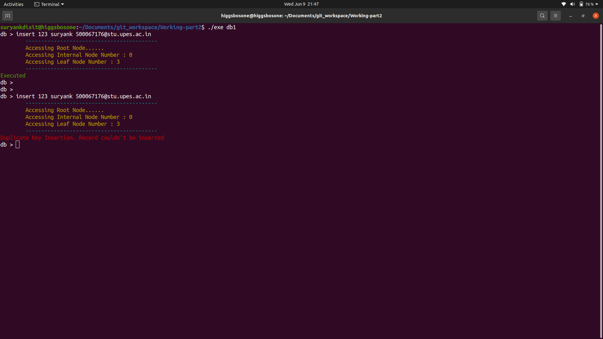
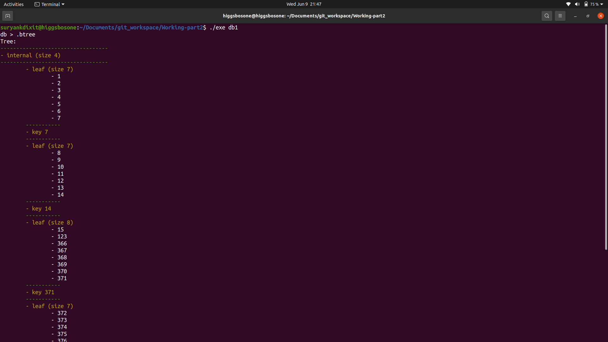
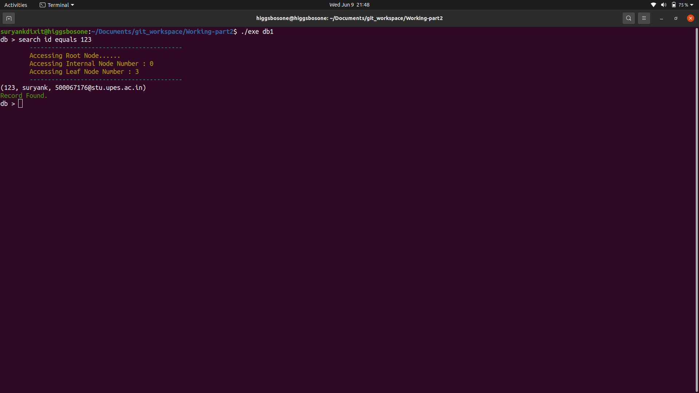
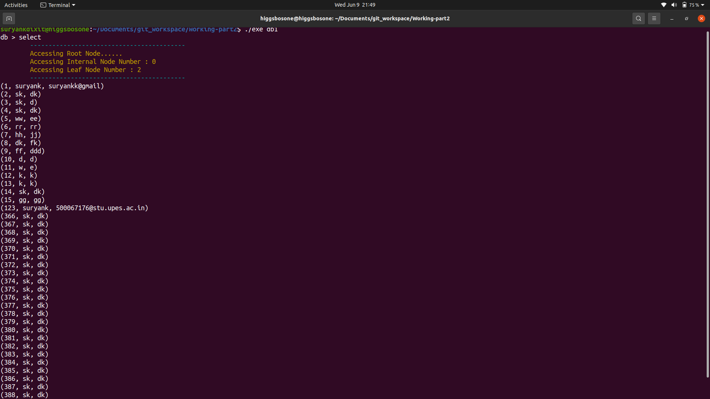

# Teensy-Weensy-Database
In this project, I have tried to clone the sqlite database from Scratch in C++. The two major parts of this project are : a). Parsing of User Input. b). Implementation of B+ trees to understand How database Indexes are Formatted.
Right now , only one hard coded table is supported in this database in which users can Insert , Select and See the format of database indexing (How the data is stored in disk.).
This is an open ended project.Like:
  - SQL compiler needs to be added for better parsing.
  - More generic approach is needed so that users can insert their own table.
So anyone who wants to help in making this library generic is welcomed. 

## Compile :    
**make** : 
  * This command will create the static library of database files which are stored in db_lib folder and link that library with the main.cpp file which acts as an application file to work with this database.

## Run :
  * ./exe (add name of your database as an argument)

## Output :

  

  

  

  

## Documentation:
Table provided in this database is of the type - Id(Integer), Name(String), Email(String)
There are 2 methods to interact with the library.

### Method 1 : Use database as a Read Evaluate Print Loop:
  * Navigate to main.cpp file and include connect.h in this.
  * Inside main function:
    * Create an object of type database as : **database* db = new database;**
    * Call **connect_db_console()** using pointer object declared in the first step as : **db->connect_db(argc,argv,db);**
  * Compile and Run.
  * This will provide you a console to interact with database.
  * Currently this library provides these functions to work on termina:
    * **insert**  (Inserts data in the database)
    * **select**  (Dumps all the data present in database)
    * **search**  (Search the record based on the ID)
    * **.btree**  (Shows to B+ tree structure of data: How data is stored in the database)
    * **.exit**   (Commits all the data in disk , closes database connection and terminates the console)

### Method 2 :  Link library with a program:
  * Functions declared in **connect.h** header file can be used by the programmers to interact.
  * Navigate to main.cpp file and include connect.h header file in this.
  * Inside main function:
    * Create an object of type database as : **database* db = new database;**
    * Call **connect_db()** using pointer object declared in the first step as : **db->connect_db(argc,argv,db);**
  * This function opens a connection to the database.
  * This will provide you a console to interact with database.
  * Currently this library provides these functions
    * **db->insert()**  (Inserts data in the database)
    * **db->print_db()**  (Dumps all the data present in database)
    * **db->print_tree()**  (Shows to B+ tree structure of data: How data is stored in the database)
    * **db->close_db()**   (Commits all the data in disk , closes database connection and terminates the console)